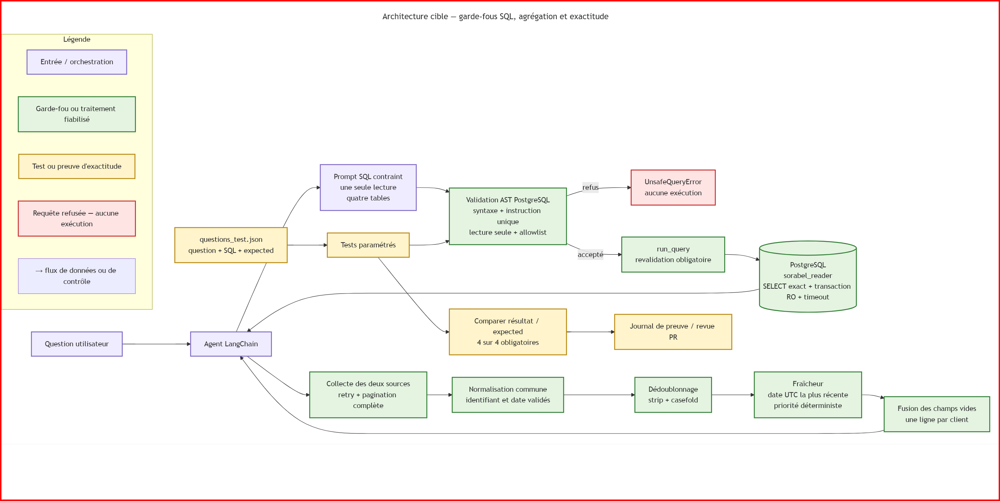

# Explication du schéma 2 — architecture cible de fiabilisation

## Objectif du schéma

Ce schéma représente l'architecture cible envisagée pour fiabiliser l'accès aux données de Sorabel. Il rassemble trois sujets complémentaires : la sécurisation du Text-to-SQL, la fiabilisation de l'agrégation multi-sources et la vérification de l'exactitude des résultats.

Le principe général est qu'aucune donnée non contrôlée ne doit atteindre directement la réponse finale. Le SQL généré doit être validé avant la base, les données externes doivent être normalisées et dédoublonnées, et les résultats chiffrés doivent être comparés à des valeurs attendues.

## Légende

- **Violet — entrée et orchestration :** question utilisateur, agent LangChain et prompt envoyé au modèle.
- **Vert — garde-fou ou traitement fiabilisé :** validation SQL, exécution contrôlée, base en lecture seule et étapes de traitement multi-sources.
- **Jaune — test ou preuve d'exactitude :** jeu de questions, tests paramétrés, comparaison des résultats et journal de preuve.
- **Rouge — requête refusée :** la requête ne respecte pas la politique de sécurité et aucune exécution n'a lieu.
- **Flèches :** circulation d'une question, d'une requête SQL, de données, d'une décision de contrôle ou d'un résultat.

## Entrée par l'agent LangChain

L'utilisateur commence par poser une question à l'agent LangChain. L'agent choisit ensuite l'outil adapté au besoin : le chemin Text-to-SQL pour une question chiffrée portant sur PostgreSQL, ou le chemin multi-sources pour obtenir une vue consolidée des clients.

L'agent joue donc un rôle d'orchestration. Il ne doit pas exécuter lui-même une requête ni fusionner directement des données brutes.

## Chemin Text-to-SQL

### Prompt SQL contraint

La question est transmise au modèle avec des instructions limitant la génération à une seule requête en lecture seule et au périmètre des quatre tables métier autorisées.

Cette contrainte réduit les mauvaises générations, mais elle ne constitue pas à elle seule une garantie de sécurité. La sortie d'un modèle reste une entrée non fiable qui doit être contrôlée.

### Validation AST PostgreSQL

Le SQL généré est transformé en arbre syntaxique abstrait, ou AST. Cette représentation permet d'analyser la structure complète de la requête plutôt que de rechercher uniquement certains mots dans une chaîne de caractères.

La validation vérifie notamment :

- que la syntaxe PostgreSQL est valide ;
- qu'il existe exactement une instruction ;
- que la requête respecte la lecture seule ;
- que les tables utilisées appartiennent à la liste autorisée ;
- qu'aucune opération ou fonction interdite n'est dissimulée dans une sous-requête.

### Acceptation ou refus

Si la requête ne respecte pas la politique, le système lève `UnsafeQueryError`. La branche rouge indique que le traitement s'arrête et qu'aucune requête n'est envoyée à PostgreSQL.

Si elle est acceptée, elle est transmise à `run_query`. L'exécuteur applique obligatoirement la validation avant l'appel à la base. Ce positionnement évite qu'un autre appelant contourne accidentellement le garde-fou.

### PostgreSQL en lecture seule

L'agent se connecte avec le compte `sorabel_reader`. Ce compte possède uniquement les droits `SELECT` nécessaires sur les tables autorisées. Les transactions sont configurées en lecture seule et un timeout limite la durée des requêtes.

Cette protection constitue une seconde barrière. Même si un contrôle applicatif comporte une erreur, le compte de l'agent ne doit pas pouvoir modifier les données ou le schéma.

## Chemin d'agrégation multi-sources

### Collecte complète

Les deux sources sont interrogées avec une stratégie de retry pour les erreurs temporaires. La pagination est suivie jusqu'à la dernière page afin d'éviter une collecte partielle.

### Normalisation commune

Chaque source utilise initialement ses propres noms de champs. Les enregistrements sont donc convertis vers un schéma commun contenant notamment un identifiant externe, une raison sociale, une ville, une date d'ingestion et le nom de la source.

Les identifiants et les dates doivent être présents et valides avant de poursuivre.

### Dédoublonnage

L'identifiant est nettoyé avec `strip()` pour supprimer les espaces inutiles et `casefold()` pour neutraliser les différences de casse. Ainsi, `FR-001` et ` fr-001 ` peuvent être considérés comme le même client.

Les enregistrements partageant la même clé normalisée sont regroupés.

### Fraîcheur et priorité

Pour chaque groupe, les dates sont converties vers un format UTC comparable. L'enregistrement le plus récent devient la version principale.

Si deux versions possèdent exactement la même date, une priorité de source documentée permet d'obtenir un résultat déterministe, indépendant de l'ordre d'arrivée des données.

### Fusion des champs

La version la plus récente est conservée en priorité. Lorsqu'un de ses champs métier est vide, il peut être complété par une valeur non vide provenant d'une version plus ancienne.

Le résultat attendu contient une seule ligne consolidée par client, sans doublon et avec les données les plus fraîches disponibles.

## Chemin de vérification d'exactitude

Le fichier `questions_test.json` contient, pour chaque cas, une question, une requête SQL de référence et une valeur attendue.

Les tests paramétrés appliquent le même scénario à tous les cas :

1. charger la question et le résultat attendu ;
2. faire passer le SQL par la validation ;
3. exécuter la requête acceptée ;
4. comparer le résultat obtenu avec `expected` ;
5. enregistrer la preuve dans le journal de correction ou la revue de PR.

Les quatre cas de référence doivent réussir. Cette vérification confirme le comportement sur les données de démonstration. Elle doit être complétée par des cas limites pour vérifier la robustesse fonctionnelle lorsque les données évoluent.

## Relation entre les trois chemins

Les trois chemins répondent à des risques différents :

- le chemin SQL limite les requêtes invalides ou dangereuses ;
- le chemin multi-sources limite les données manquantes, dupliquées ou périmées ;
- le chemin d'exactitude vérifie que le résultat final correspond à ce qui est attendu.

Ces protections sont complémentaires. Une requête peut être techniquement sûre tout en donnant un mauvais chiffre, et des données correctement agrégées ne compensent pas une requête fonctionnellement incorrecte.

## Idée principale

L'architecture applique plusieurs niveaux de contrôle. Le prompt guide la génération, le validateur décide si le SQL peut être accepté, l'exécuteur rend le contrôle obligatoire, PostgreSQL limite les privilèges, l'agrégation fiabilise les données externes et les tests vérifient les résultats obtenus.

